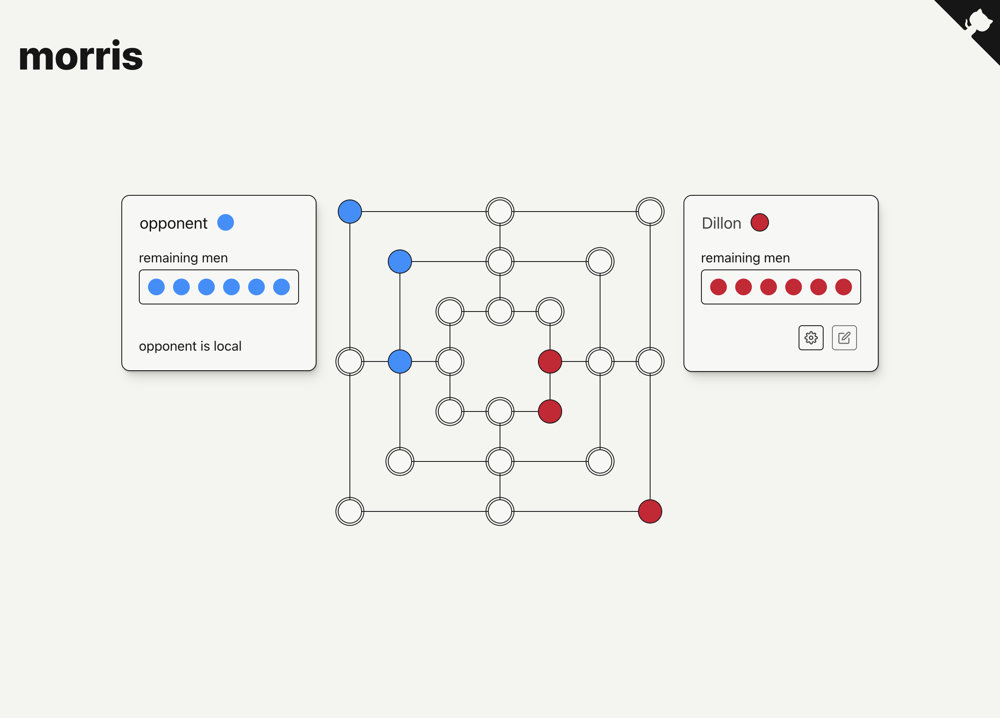

# morris

The goal here is to create n-men morris just for fun using typescript and react. Some goals:

- have multiplayer
- have a bot play perfectly against you
- extend into unprecedented n's
- extend into 3 dimensions

The experience is live [here](https://morris.cutaiar.io/). And it looks like this:

## Development

From a fresh clone, make sure you have `pnpm` and run `pnpm i`, then `pnpm dev`.

The monorepo hosts a number of packages:

- `morris-ai` - Decision making
- `morris-core` - Core game implementation
- `morris-server` - multiplayer node server
- `morris-ui` - react frontend

`core` and `ai` are imported without transpiling and used by `ui` and `server` which each have their own development process. Both can be run `concurrently` using `pnpm dev` from the root here.
